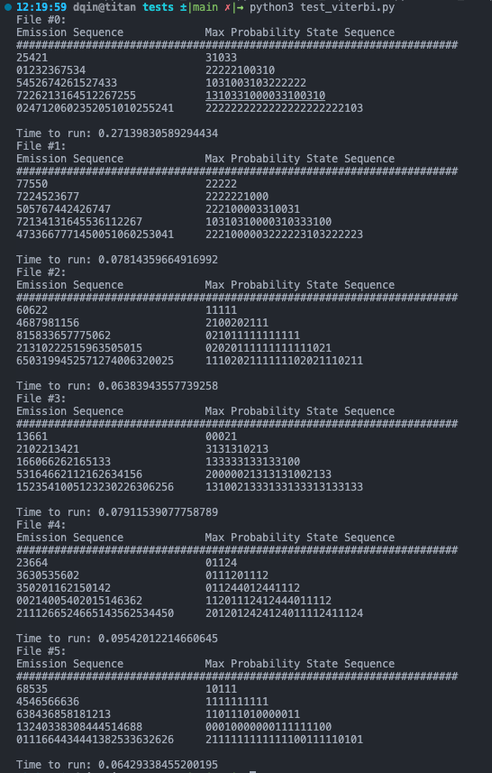

# cudaHMM

This repository implements Hidden Markov Models using GPU acceleration. This
includes the Viterbi algorithm for finding the maximum probability state
sequence, supervised HMMs using hidden state data, and unsupervised HMMs using
an emission sequence. This model implements the Baum-Welch algorithm and uses
CuPy for GPU acceleration.

## CPU Demo

The CPU Demo can be found in the `cpu` directory.

### Installation

To run the CPU demo, run

```shell
pip install -r requirements.txt
cd cpu
python3 demo.py
```

This can take several minutes to run, and should generate a series of sentences
generated using a Hidden Markov Model trained on the Bee Movie script by
default.

To train on different inputs, modify `demo.py`

### Testing

Tests were taken from CS 155 to verify correctness. Each test is in the test
directory under `cpu/tests` and labeled `test_<functionality>.py`. Simply run
each as a script. The expected output is stored in the corresponding text file.

### GPU Parallelizability

See `TODO` comments in the CPU demo source code.

## GPU Results

All GPU functionality should operate identically to the above descriptions for
CPU code. Tests can be run in exactly the same way under the `cuda` directory.

Example test run:



## Performance Analysis

Unfortunately, the GPU implementation does not offer significant improvements
in most areas. By testing seperate components to determine the source of
slowdown, we can observe that the Viterbi algorithm, forward-backward functions,
and supervised learning run in faster or comparable time (with a x10
improvement for the Viterbi Algorithm). This is because they were efficiently
vectorized. On the other hand, the unsupervised learning algorithm runs
exceedingly slowly, since there are expensive memory transactions between
host memory and device memory. These memory transactions could not be written
out in the timespan of the project.

For future improvement, most of the work will be to improve the algorithm
implementation so more is stored in device memory before the result is
required.